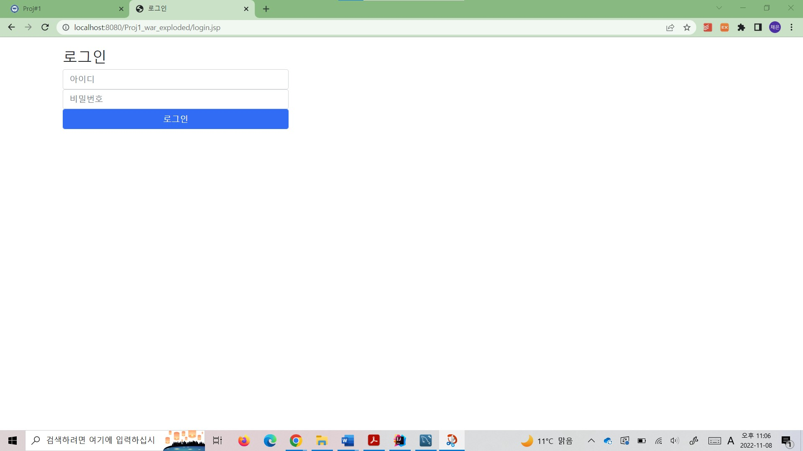
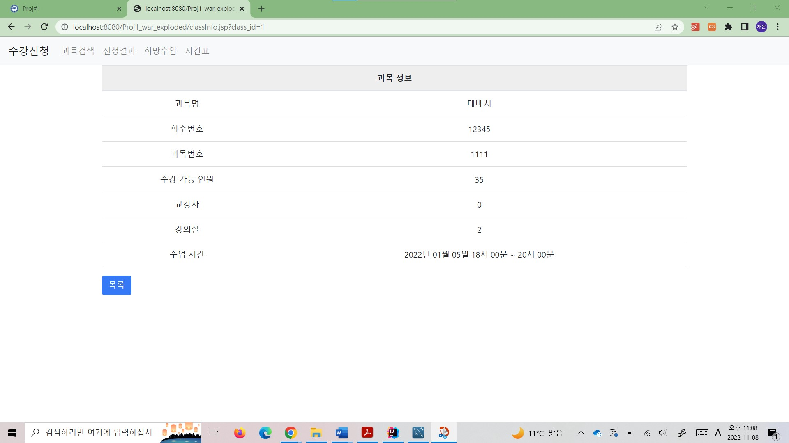
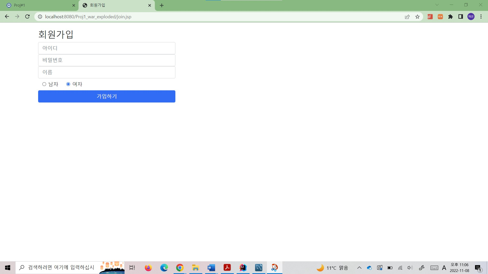
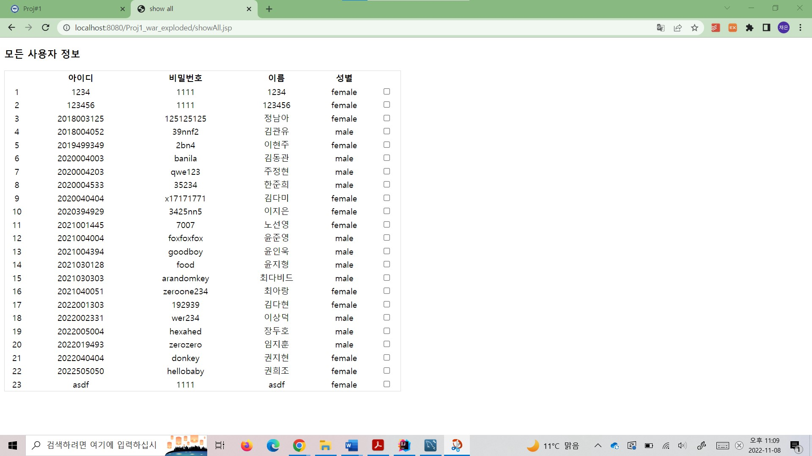
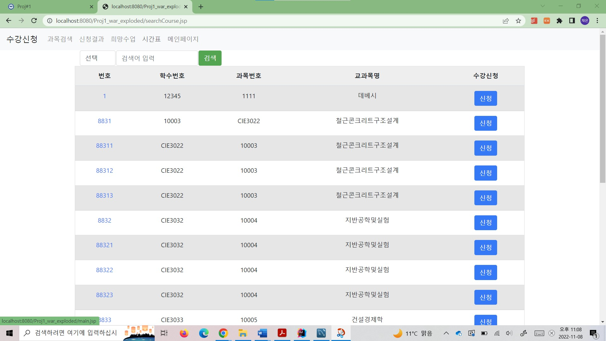
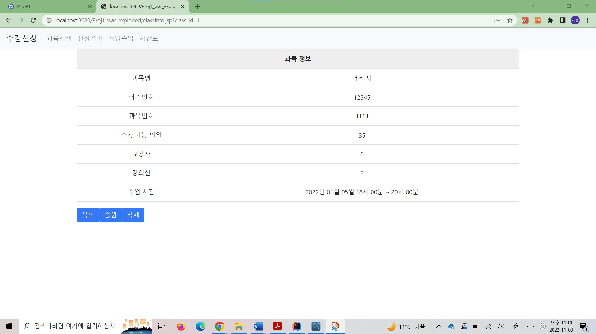

# Course Registration DB System

대학 수강신청 시스템을 구현한 데이터베이스 프로젝트입니다.  
학생/교강사 계정을 구분하여 로그인하고, 수강 신청, 시간표 조회, 과목 추가 및 삭제 등의 기능을 제공합니다.

---

## 🛠 기술 스택

- **Language**: Java, Jsp
- **Database**: MySQL

---

## ⚙️ 주요 기능

- 사용자 권한에 따라 학생/관리자 계정으로 로그인
- 학생:
  - 수강 신청, 희망 과목 등록, 신청 결과 조회
- 관리자(교강사):
  - 과목 정보 열람 및 수정 (증원, 폐강 등)
  - 학생 성적 및 수강 정보 조회
- 과목 등록 시 유효성 검사 (강의실 수용 인원 초과/요일 제한 등)

---

## 📁 프로젝트 구조

```
course-registration-db-system/
├── .mvn/wrapper/     # Maven Wrapper 설정 파일
├── src/              # Java, Jsp 코드
├── report/           # 프로젝트 보고서 및 wiki 문서
├── screenshots/      # 실행 화면 캡처 이미지
└── README.md         # 프로젝트 설명 파일
```

---

## 🖼 주요 화면

| 화면 | 설명 |
|------|------|
|  | 로그인 페이지 |
|  | 학생 로그인 시 과목 페이지 |
|  | 회원가입 페이지 |
|  | 사용자 정보 페이지 |
|  | 과목 검색 페이지 |
|  | 관리자 과목 관리 페이지 |

---

## 📄 프로젝트 문서

- [`milestone1_wiki.docx`](./report/milestone1_wiki.docx)
- [`milestone2_wiki.docx`](./report/milestone2_wiki.docx)

---